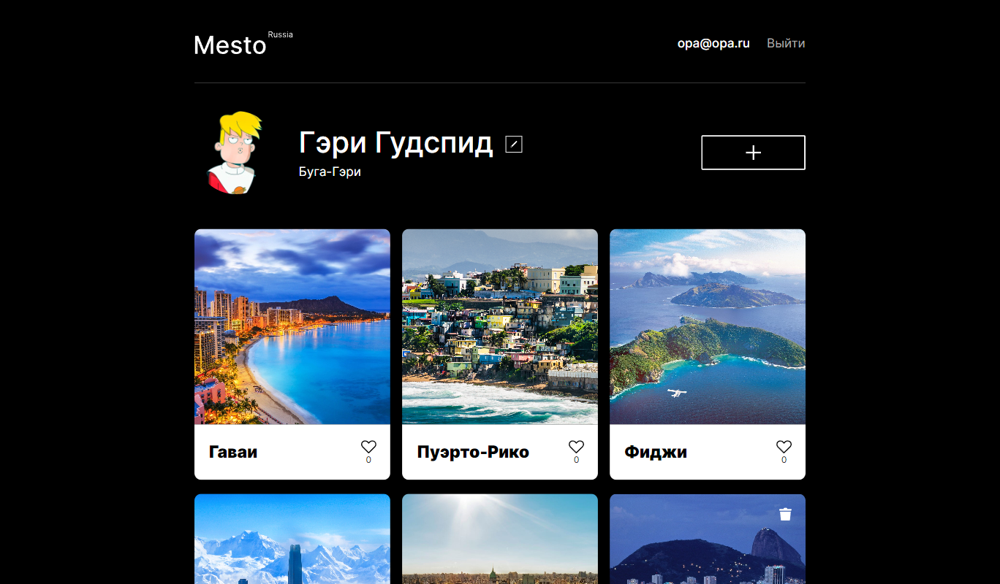

# Проект: Место (frontend + backend)

Учебный проект выполненный в рамках курса "Веб-разработчик" от Яндекс Практикум.
Проект представляет из себя веб-приложение в сборе, имеющие бэкенд часть, основой для которой послужил [проект](https://github.com/Bjorn86/express-mesto-gha) также выполненный в рамках учебного курса, а также фронтенд часть, основой для которого послужил ещё один [проект](https://github.com/Bjorn86/react-mesto-auth) выполненный в рамках указанного выше учебного курса.

## Оглавление

- [Обзор проекта](#обзор-проекта)
  - [Задачи проекта](#задачи-проекта)
  - [Функциональность проекта](#функциональность-проекта)
  - [Screenshot](#screenshot)
  - [Директории проекта](#директории-проекта)
  - [Запуск проекта](#запуск-проекта)
  - [Ссылки](#ссылки)
- [Ход выполнения проекта](#ход-выполнения-проекта)
  - [Используемые технологии](#используемые-технологии)
  - [Чему я научился работая над проектом](#чему-я-научился-работая-над-проектом)
- [Автор](#автор)

## Обзор проекта

### Задачи проекта

Проект призван закрепить вре ранее полученные в рамках учебного курса знания. Создать полностью рабочее веб-приложение, и разместить его на хостинге.

### Функциональность проекта

- Backend:
  - В проекте созданы схемы и модели пользователей и карточек с контентом:
    - `card` — схема карточки с контентом
    - `user` — схема пользователя
  - В проекте созданы эндпоинты:
    - `/cards` — обрабатывает:
      - GET запросы — отдаёт все карточки из БД
      - POST запросы — создаёт новую карточку с контентом
    - `/cards/:cardId` — обрабатывает DELETE запросы, удаляет карточку по `cardId`
    - `/cards/:cardId/likes` — обрабатывает:
      - PUT запросы — добавляет лайк карточке с контентом
      - DELETE запросы — удаляет лайк карточке с контентом
    - `/signin` — обрабатывает POST запросы, производит аутентификацию пользователя
    - `/signup` — обрабатывает POST запросы, производит регистрацию пользователя
    - `/users` — обрабатывает:
      - GET запросы — отдаёт всех пользователей из БД
      - POST запросы — создаёт нового пользователя
    - `/users/:userId` — обрабатывает GET запросы, отдаёт пользователя по `userId`
    - `/users/me` — обрабатывает:
      - GET запросы — отдаёт информацию о текущем пользователе
      - PATCH запросы — обновляет информацию о пользователе
      - DELETE запросы — производит выход пользователя, с удалением JWT-токена из Cookie
    - `/users/me/avatar` — обрабатывает PATCH запросы, обновляет аватар пользователя
  - Созданы мидлвары:
    - Централизованной обработки ошибок
    - Авторизации пользователя
    - Ограничитель количества запросов (защита от DDoS атак)
    - Поддержки CORS запросов, включая обработку предварительных запросов
    - Логирования запросов и ошибок
  - Производится валидация поступающих данных:
    - до передачи информации контроллерам с помощью joi и celebrate
    - на уровне схем с помощью validator и встроенных методов mongoose
- Frontend:
  - Возможность регистрации и аутентификации пользователя
  - Возможность редактировать информацию о пользователе (установить имя пользователя, информацию «о себе», аватар)
  - Возможность создавать карточки мест (добавить\удалить карточку места, поставить\снять лайк карточке)
  - Возможность просматривать детальную фотографию карточки
  - Реализована валидация форм с помощью кастомного хука

### Screenshot

### Директории проекта

- `/backend` — директория с файлами бэкенд части проекта
  - `/controllers` — директория с файлами контроллеров
  - `/errors` — директория с файлами кастомных ошибок
  - `/middlewares` — директория с мидлварами
  - `/models` — директория с файлами описания схем и моделей
  - `/routes` — директория с файлами роутера
  - `/utils` — директория со вспомогательными файлами
- `/frontend` — директория с файлами фронтенд части проекта
  - `/static` — директория со статичными файлами фронтенд части проекта

### Запуск проекта

- `npm lint` — запускает проверку линтером
- `npm run start` — запускает сервер
- `npm run dev` — запускает сервер с hot-reload

### Ссылки

- IP 158.160.53.34
- Frontend <https://mesto.ld-webdev.nomoredomains.monster>
- Backend <https://api.mesto.ld-webdev.nomoredomains.monster>

<!-- - [Ссылка на репозиторий проекта](https://github.com/Bjorn86/react-mesto-api-full-gha)
- [Ссылка на страницу проекта](https://mesto.ld-webdev.nomoredomains.monster)
- [Ссылка на API сервер проекта](https://api.mesto.ld-webdev.nomoredomains.monster)
- IP-адрес проекта: 158.160.53.34 -->

## Ход выполнения проекта

### Используемые технологии

- [Node.js](https://nodejs.org/ru)
- [nodemon](https://nodemon.io/)
- [Express](https://expressjs.com/)
- [cookie-parser](https://www.npmjs.com/package/cookie-parser)
- [MongoDB](https://www.mongodb.com/)
- [mongoose](https://mongoosejs.com/)
- [bcryptjs](https://www.npmjs.com/package/bcryptjs)
- [jsonwebtoken](https://www.npmjs.com/package/jsonwebtoken)
- [joi](https://joi.dev/)
- [celebrate](https://www.npmjs.com/package/celebrate)
- [validator](https://www.npmjs.com/package/validator)
- [express-rate-limit](https://www.npmjs.com/package/express-rate-limit)
- [helmet](https://helmetjs.github.io/)
- [winston](https://www.npmjs.com/package/winston)
- [express-winston](https://www.npmjs.com/package/express-winston)
- [ESLint](https://eslint.org/)

### Чему я научился работая над проектом

- Разворачивать сервер на Node.js
- Использовать в работе фреймворк Express
- Работать с БД MongoDB
- Использовать в работе с БД ODM mongoose
- Создавать схемы и модели для работы с БД
- Обрабатывать различные виды запросов
- Обрабатывать ошибки некорректных запросов
- Валидировать приходящую в запросе информацию
- Работать с JWT-токеном
- Работать с Cookies
- Базовой защите приложения
- Логированию
- Работе с CORS
- Деплою проекта на реальный хостинг

## Автор

**Данила Легкобытов**

- e-mail: [legkobytov-danila@yandex.ru](mailto:legkobytov-danila@yandex.ru)
- Telegram: [@danila_legkobytov](https://t.me/danila_legkobytov)
